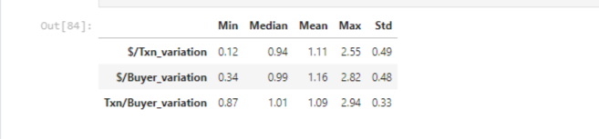

# Project-2 Ironhack Data Analytics Bootcamp

## Tracking Top NFT Collections' KPIs

### Description
As everyone knows, the NFT market has experienced a decline over the last months, Dropping floor prices and increasing sell pressure has been the overall trend. For this project, I selected a data set of the top 250 NFT Collections ordered by USD sales, from November 2021. I will use an API to compare the top 100 collections from then, to the actual ranking. I will explore the distribution of collections between blockchains and use KPIs to evaluate their development and resiliency. The next two images represent the evolution of floor prices and sales volume of two 'blue chip' collections (Cool Cats and Bored Ape Yatch Club, respectively). This is just to show some facts of the downward trend.

### Cleaning Conclusion:
Focus: 
Top 100 collections that managed to remain in the top 100 since Nov 21 until now, as those are supposed to be the less risky investment and more resilient to market conditions.

Main KPIs studied: 
- Sales in USD/Txn Variation	
- Sales in USD/Buyer Variation
- Txn/Buyer Variation

Throughout the study, we can see that although the NFT market as a whole has seen sharp declines in floor prices and sales volumes, the top collections, the ones that have managed to stay in the top 100 since November 2021 until now, have experienced: 
1. An increase in dollars spent per transaction
2. An increase in dollars spent per buyer 
3. An increase in transactions per buyer 

Shown by the mean being > 1.

Although values have a quite high standard deviation, the median suggests that ratios have remained constant, which is quite impressive taking into account market conditions. We need to consider that this sample contains mainly ethereum projects, so it may be a bit biased for the rest of blockchains.

### Visualization Conclusion:
In Graph 1, we see that top collections are usually built in ethereum as Sales have increased much more proportionately to the rest of blockchains.

Graph 2 shows something very interesting, even though collections in ethereum receive more funding, we can see that other blockchains (with less projects in the top 100) manage to process more transactions. This suggests that collections built on ethereum might be more expensive.

Graph 3 suggests that projects built on top of ethereum (and solana, but less representative) are the most resilient to market conditions as shown by the mean of the following ratios:
1. $/Txn_variation > 1
2. $/Buyer_variation > 1
3. Txn/Buyer_variation > 1

Blockchains such as flow and wax have seen a reduction in dollars spent per transaction and an increase in transactions per buyer, suggesting that there is demand for low priced NFT collections.

### Author:
Carlos Muñoz Fresco

### Documentation: 
The data set comes from Kaggle.